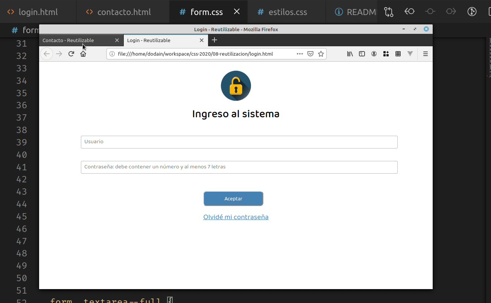

## Formas de reutilizar estilos

La curva de aprendizaje de CSS es baja: rápidamente podemos ponernos en acción y lograr cambios positivos en nuestros formularios. Pero cuando se trata de buscar técnicas de reutilización, nos encontramos con dificultades, aun cuando se trata de un lenguaje declarativo y que tiene reglas sencillas que están pensadas para aplicarse "en cascada":

- el estilo de fuente que definimos se aplica desde el elemento raíz hacia los hijos
- también hemos visto que definir un font-size de 10 píxeles permite trabajar con medidas espaciales relativas `em` y `rem` en cascada
- si tenemos este tag html

```html
<div class="saraza">
  Soy un div
</div>
```

hemos visto en [el ejemplo de especificidad](https://github.com/uqbar-project/css-01-especificidad) que podemos trabajar con reglas generales para los divs y más específicas para las clases:

```css
div {
  /* reglas a aplicar para los divs */
}

.saraza {
  /* reglas específicas para tags que tengan clase saraza */
}
```

De todas maneras, después de estar acostumbrados a trabajar en el paradigma OO, css está lejos de tener técnicas similares para la reutilización de código.

## Técnica BEM: Block, Element, Modifier

La técnica BEM consiste en que cada elemento HTML puede encontrarse en una jerarquía de 3 niveles:

- block: representa una abstracción
- element: forma parte de un block, semánticamente está ligado a él 
- modifier: se utilizan para cambiar la apariencia o representar distintos estados de un elemento o un bloque.

Por ejemplo, tendremos el bloque **form**, con un modificador **form--card** que representa la apariencia de una tarjeta. 

El bloque form tiene varios elementos, que no tienen sentido fuera del form:

- **fila**: representa una fila de un formulario, y contiene diferentes inputs.
- **input**: representa un campo editable para el usuario, tiene el modificador _full_ para indicar que toma el máximo ancho posible.
- otros elementos que dependen del form son: `titulo`, `logo`, `botonera`, `boton`, `textarea`, etc. A cada uno le anteponemos el prefijo `form__`, por ejemplo: `form__boton` y opcionalmente algún modificador, como `form__boton--primario`. Esto permite configurar estilos separados para un botón que forma parte de un formulario y el que está en otro tipo de página.

### Definición de un identificador en BEM

La idea es que el identificador se forme como

- **Block**,
- **Block__element**, 
- **Block__element--modifier**, o
- **Block--modifier**

Es decir, utilizamos `__` para separar un bloque de un elemento, y `--` para separar un bloque o elemento de un modificador.

### Buenos nombres

Una cuestión importante es que evitaremos nombres demasiado específicos o crípticos: 

- en lugar de `naranja` -> `primario` o `colorPrimario`
- en lugar de `boton-de-20-pixeles` -> `chico`
- en lugar de `ta-4-5` (textarea de 4 filas y 5 columnas) -> `comun`

## Ventajas de BEM

Esta convención de nombres ayuda a evitar que proliferen muchas clases, porque cada clase se adapta a un elemento o bloque particular. Es más fácil que nos animemos a tocar `form__input--full` que una clase que se llame `full`, porque nos da miedo el impacto que puede tener esa cascada: ¿qué representa semánticamente ese full en la aplicación? ¿estaré rompiendo `div`s que tengan una clase `full`, o una `table`?

En el ejemplo, podemos ver dos archivos:

- login.html: representa un formulario de login
- contacto.html: representa un formulario de contacto

Ambos tienen dos archivos de estilos:

- estilos.css: definen cuestiones comunes para todas las páginas, como la tipografía, podríamos eventualmente cambiar nuestro color de fondo, etc.
- form.css: arma los estilos propios de un formulario. **Todas las páginas que tengan formulario pueden usar esta hoja de estilos**.

Así podemos ver que ambos tienen el mismo look & feel, y al cambiar una configuración esto tiene impacto en todas las páginas que usen el formulario:



## Múltiples clases

Un detalle adicional es que el `textarea` necesita una configuración adicional al ser un tipo de tag diferente, pero podemos definirle más de una clase:

```html
<textarea placeholder="El motivo de su consulta" class="form__input--full form__textarea"></textarea>
```

En la hoja de estilos tendremos dos clases, la de textarea agrega información:

```css
.form__input--full {
  width: 100%;
  font-size: 0.8em;
}

.form__textarea--full {
  padding: 0.5rem;
}
```

Incluso tuvimos que modificar el placeholder en el archivo estilos.css, para que no se viera con un font feo:

```css
:-moz-placeholder {
  font-family: 'Baloo Da 2', serif;
}
::-moz-placeholder {
  font-family: 'Baloo Da 2', serif;
}
```

## Cómo hacer para reutilizar partes para un estilo

Si el usuario nos pide que el teléfono de contacto tenga un tamaño menor que el resto de los campos del formulario, podemos definir una nueva class, que será `form__input` pero que tendrá un modificador diferente:

```css
.form__input--medium {
  font-size: 0.9em;
  width: 50%;
}
```

El tema es que ya tenemos una definición `.form__input--full` que tiene algo en común:

```css
.form__input--full {
  font-size: 0.9em;
  width: 100%;
}
```

El font-size lo podemos compartir entre ambas clases, de esta manera:

```css
.form__input--full, .form__input--medium {
  font-size: 0.9em;
}

.form__input--full {
  width: 100%;
}

.form__input--medium {
  width: 50%;
}
```

Y el html quedaría

```html
<div class="form__fila">
  <input type="text" placeholder="Nombre completo" class="form__input--full">
</div>
<div class="form__fila">
  <input type="text" placeholder="Teléfono de contacto" class="form__input--medium">
</div>
```

Otra opción es utilizar una clase específica para los `form__input` y modificadores adicionales:

```css
.form__input {
  font-size: 0.9em;
}

.form__input--full {
  width: 100%;
}

.form__input--medium {
  width: 50%;
}
```

Esto requiere que nuestra definición en el html sea más verbosa:

```html
<div class="form__fila">
  <input type="text" placeholder="Nombre completo" class="form__input form__input--full">
</div>
<div class="form__fila">
  <input type="text" placeholder="Teléfono de contacto" class="form__input form__input--medium">
</div>
```

## Resumen

Hay herramientas que nos pueden ayudar a la hora de reutilizar definiciones de estilos en nuestros archivos html: trabajar en cascada definiciones generales y específicas, agrupar ideas en diferentes clases, y utilizar técnicas como BEM (hay otras como OOCSS o SMACSS) son algunas de ellas, aunque sin dudas todavía queda un largo camino por recorrer para mejorar la mantenibilidad de nuestro css.

## Material adicional

- [BEM 101](https://css-tricks.com/bem-101/)
- [Building a Scalable CSS Architecture with BEM and Utility Classes](https://css-tricks.com/building-a-scalable-css-architecture-with-bem-and-utility-classes/)
- [Get BEM](http://getbem.com/)
- [How to Organize Your CSS with a Modular Architecture (OOCSS, BEM, SMACSS)](https://snipcart.com/blog/organize-css-modular-architecture)
